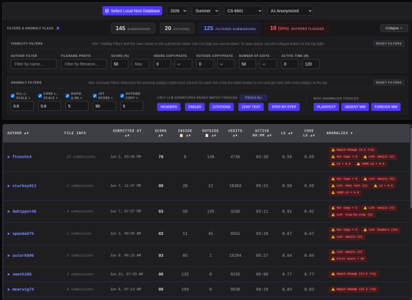

# Nosi-dashboard
Nosi-dashboard is the instructor-side companion tool to the Nosi-IDE. Nosi-IDE is a fork of VS Code. It is an anti-cheating IDE. Its goal is to improve coding education, especially addressing the challenges posed by Large Language Models (LLMs). Nosi is designed to edit and run the encrypted homework file. It logs students' interaction data during the coding/editing process. Those coding process logs are visualized and analyzed using the Nosi-dashboard. Link to [paper](https://doi.org/10.1145/3774398.3811574)

## Nosi student-side IDE
You can learn more about the Nosi student-side IDE using this [link](https://github.com/Nosi-Inc/Nosi-IDE#nosi-features-and-common-operations)

## Nosi-dashboard

The Nosi-dashboard is an interactive, web-based analytics platform designed for educators to audit and visually inspect students' coding workflows.

Below is a quick tutorial containing a typical TA/Instructor workflow.

### Nosi-dashboard Overview

The Nosi-IDE and Nosi-dashboard provide scaling proctoring for coding assignments. Especially in the age of LLM. It enables TAs and instructors to efficiently inspect and investigate students' coding processes. Inspecting all students' submissions in a large class is unrealistic due to the monumental workload. The Nosi-dashboard helps TAs and instructors to focus their attention on submissions that are likely problematic using process-based metrics first. Key LLM usage signatures are labeled as anomaly badges for further investigations. Once the suspicious files are labeled and sorted by anomaly level, the instructor/TA can review them one by one. Currently, the dashboard provides three views.
 * **Replay**: Breaks down students' code writing into different active coding sessions. The investigator can replay the student's homework editing process and visualize suspicious activities.
 * **Inspect**: Shows suspicious signatures in the student's final code submission. Sometimes, students have fewer anomalies in their final code submission than during the coding process, suggesting attempts to hide their tracks.
 * **Diff**: Shows the number of non-trivial line changes between consecutive submissions to the autograder service. Sometimes, inhumanly fast coding speed is a sign of using an LLM.

### Visibility Filter
The Visibility Filter operates on the primary submissions table, allowing instructors to isolate specific records based on standard workspace attributes.

### Anomaly Filter
The Anomaly Filter applies automated heuristics over the telemetry logs to generate warning badges (shown on the far right of the submission table). After adjusting the visibility filter and the anomaly filter, you can collapse the filter settings and reclaim some real estate to see more rows in the submissions table.

### Student Coding-process Replay
The Replay workspace lets you watch the literal evolution of a student's code, character by character. Press the `space bar` to play/pause the playback. Press `[`/`]` to step one step `backward`/`forward`. Stepping auto pauses the playback. Press `-`/`=` to `slow down` / `speed up` the playback. You can also use `WASD` or `HJKL` for the control. You can expand or collapse coding sessions and the copy-paste event card to further inspect them. Clicking the active coding session card or the copy-paste event card allows you to jump directly to that edit. 

### End Result Inspection
The Inspect tab displays the final submitted code alongside structural telemetry insights.

### Diff Between Submission Inspect
The Diff tab renders a side-by-side comparison between the current submission and the student's previous historic submission.

