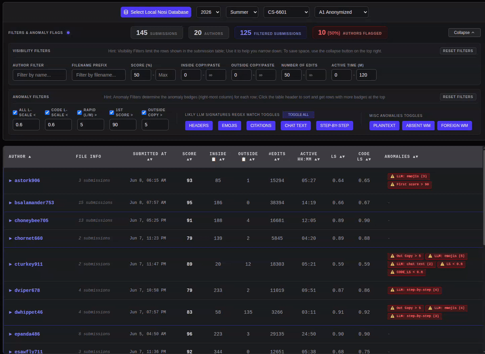

# Nosi-dashboard
Nosi-dashboard is the instructor-side companion tool to the Nosi-IDE. Nosi-IDE is a fork of VS Code. It is an anti-cheating IDE. Its goal is to improve coding education, especially addressing the challenges posed by Large Language Models (LLMs). Nosi is designed to edit and run the encrypted homework file. It logs students' interaction data during the coding/editing process. Those coding process logs are visualized and analyzed using the Nosi-dashboard. Link to [paper](https://doi.org/10.1145/3774398.3811574)

## Nosi student-side IDE
You can learn more about the Nosi student-side IDE using this [link](https://github.com/Nosi-Inc/Nosi-IDE#nosi-features-and-common-operations)

## Nosi-dashboard Demo

The Nosi-dashboard is an interactive, web-based analytics platform designed for educators to audit and visually inspect students' coding workflows.

**Click on the image to try a live [demo](https://bit.ly/nosi-demo)!**

Below is a quick tutorial containing a typical TA/Instructor workflow. You are encouraged to follow along. After you get comfortable with it, please feel free to explore on your own.

### Nosi-dashboard Overview

The Nosi-IDE and Nosi-dashboard provide scaling proctoring for coding assignment. Especially in the age of LLM. It fascilitates TAs and instructors to inspect and investigate students' coding process efficiently. Inspecting all students' submissions in a large class is unrealistic due to the monumental workload. The Nosi-dashboard helps TAs and instructors to focus their attention on assignments that is likely problematic using process-based metrics first. Key LLM usage signatures are labeled as anamoly badges for further investigations. Once the suspicious files are labeled and sorted by their anomaly level, the instructor/TA can go through them one by one. Currently, the dashboard provide three views.
 * **Replay**: Breaks down students' code writing into different active coding sessions. The investigator can replay the student's homework edit process and visualize suspicious activities.
 * **Inspect**: Shows suspicoius signatures in the student's final code submission. Sometimes, students have fewer anomalies in the final code submssion than the coding process, showing atempts to hide their tracks.
 * **Diff**: Shows the number of non-trivial line changes between consecutive submissions to the autograder service. Sometimes, inhumanly fast coding speed is a sign of using LLM

### Visibility Filter
The Visibility Filter operates on the primary submissions table, allowing instructors to isolate specific records based on standard workspace attributes.

### Anamoly Filter
The Anomaly Filter applies automated heuristics over the telemetry logs to generate warning badges (shown on the far right of the submission table).

### Student Coding-process Replay
The Replay workspace allows you to watch the literal evolution of a student's code, character-by-character. Press the `space bar` to play/pause the playback. Press `[`/`]` to step one step `backward`/`forward`. Stepping auto pauses the playback. Press `-`/`=` to `slow down` / `speed up` the playback. You can also use `WASD` or `HJKL` for the control. You can expand or collapse coding sessions and the copy-paste payload card to further inspecting them. Clicking on the active coding session, and the copy-paste payload jumps to that edit directly.

### End Result Inspection
The Inspect tab display the final submitted code alongside structural telemetry insights.

### Diff Between Submission Inspect
The Diff tab renders a side-by-side comparison between the current submission and the student's previous historic submission.

